

  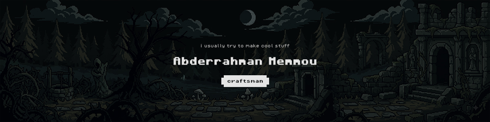

  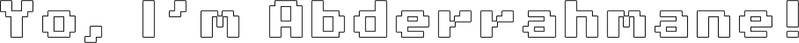

calligraphist and designer by day (undercover [NHS-AI](https://dz.linkedin.com/school/ensia-school/) student), software engineer by night.

i build systems from scratch, fix problems that shouldn’t have existed, and redesign old systems just to prove the client wrong. i also craft letters into art; nothing too complicated, just effortless beauty.

*Don’t waste my time, don’t waste yours.*

  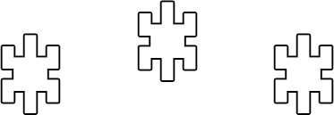

  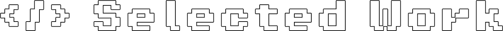

* **[mawj (موج)](https://github.com/yourusername/mawj)** : Bulk media engine for Arabic creators. GPU-accelerated rendering, dynamic diacritic-aware typography, and **5M+ social views** generated.
* **[veer](https://github.com/yourusername/veer)** : Zero-infra, decentralized load balancer. Uses a lightweight gossip protocol and signed packets for adaptive client routing.
* **[que](https://github.com/yourusername/que)** : Disk-backed membership engine with constant RAM usage. Handles sub-millisecond lookups across massive datasets.

> *Other open-source work (algorithms like VQ-Sort, JS state engines, WinRT tools) pinned below.*

  

  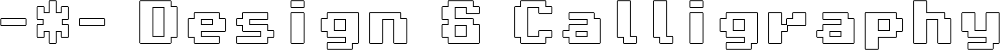

*(Design portfolio dropping soon)*

* **Brand & Apparel:** Brand identity and merchandise design for prominent online figures.
* **Visual Art:** Arabic calligraphy, book covers, posters, and automated video pipelines.
* **Creative Tech:** GLSL shaders, Blender, and web art.

  

  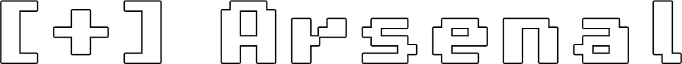

  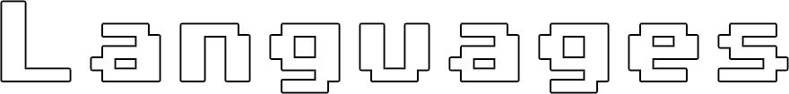

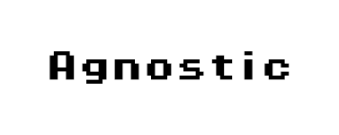
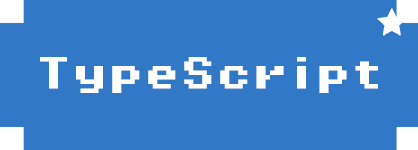
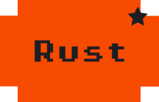

  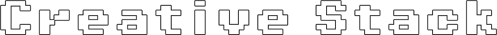

  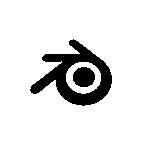
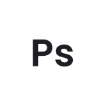
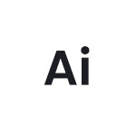
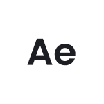

  

  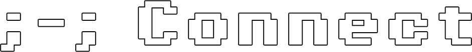

